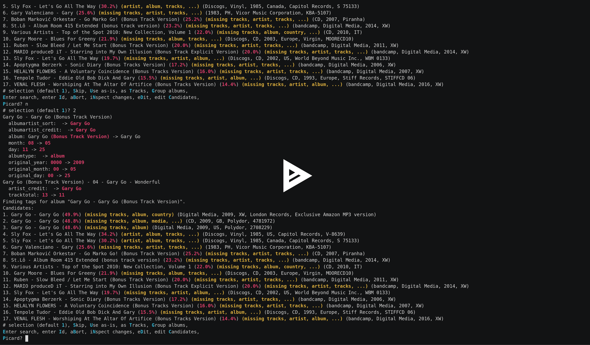

# Beets-Library

My personal beets configuration and scripts

## Plugins

### import_inspect

Inspect the changes that will be applied when selecting a candidate during the import process.

This is particularly helpful when you have many candidates with similar information, as it gives you enough detail to differentiate, for example the total number of tracks, month/day, albumdisambig, etc. The display is the same as that used by `beet-modify` and others, as it uses the same `ui.show_model_changes` function to do the work.

#### Usage

Example inspection output:
```
Gary Go - Gary Go (Bonus Track Version)
  albumartist_sort:  -> Gary Go
  albumartist_credit:  -> Gary Go
  album: Gary Go (Bonus Track Version) -> Gary Go
  month: 08 -> 09
  day: 11 -> 15
  albumtype:  -> album
  albumdisambig:  -> Exclusive Amazon MP3 version
  original_year: 0000 -> 2009
  original_month: 00 -> 05
  original_day: 00 -> 25
Gary Go (Bonus Track Version) - 04 - Gary Go - Wonderful
  artist_credit:  -> Gary Go
  tracktotal: 13 -> 12
```

[](https://asciinema.org/a/1r3HoearzkY2A8QG417bVM5nR)
